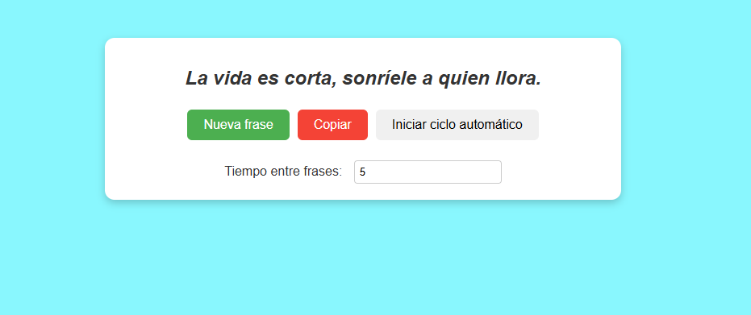
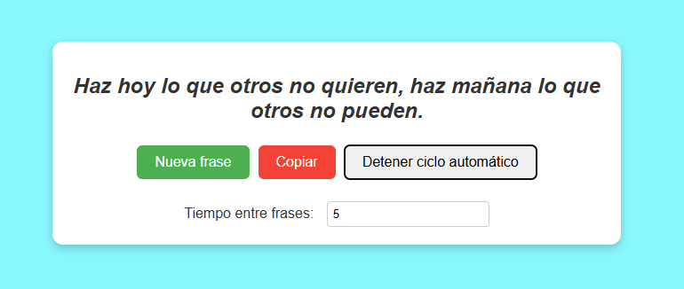

# 📝 Random Phrases App

Una aplicación sencilla hecha con **React** que muestra frases aleatorias desde un archivo local (`db.json`).  
Permite cambiar manualmente las frases, copiarlas al portapapeles o activar un ciclo automático que las cambia cada cierto tiempo configurable.

---

## 🏷️ Badges


---

## 🚀 Características

- Muestra frases almacenadas localmente en `db.json`.
- Permite avanzar manualmente a la siguiente frase.
- Copia fácilmente la frase actual al portapapeles.
- Opción para iniciar/detener el ciclo automático de frases.
- Posibilidad de ajustar el intervalo de tiempo entre frases automáticas.
- Totalmente responsive y de carga instantánea.

---

## 🛠️ Tecnologías utilizadas

- **React (Vite)**
- **Hooks**: `useState`, `useEffect`
- **CSS clásico** para los estilos
- **Clipboard API** para copiar frases

---

## 📂 Estructura del proyecto

```
    src/
    │
    ├── App.jsx          # Componente principal
    ├── App.css          # Estilos del proyecto
    └── db.json          # Base de datos local con las frases
```

---

## 📸 Capturas

### Dashboard principal




### Vista móvil


---

## ⚙️ Instalación y uso

1.  Clonar el repositorio:

```
        git clone https://github.com/luisgutierrez11/phrases-random-app.git
        cd phrases-random
```

2.  Instalar dependencias:

```
        npm install
```

3.  Iniciar el proyecto:

```
        npm run dev
```

4.  Abrir en el navegador:

```
        http://localhost:5173
```

---

## 📘 Notas adicionales

- Si querés que las frases cambien en orden **aleatorio**, podés reemplazar la línea de cambio de índice por:

```
        setIndex(Math.floor(Math.random() * quotes.length))
```

- El archivo `db.json` debe contener un array de strings, por ejemplo:

```
        [
          "La vida es un 10% lo que te sucede y un 90% cómo reaccionas a ello.",
          "El éxito no es la clave de la felicidad, la felicidad es la clave del éxito.",
          "Haz hoy lo que otros no quieren, y mañana vivirás como otros no pueden."
        ]
```

---

## 🧠 Aprendizajes

Este proyecto sirve como práctica para:

- Manejo de estado y efectos secundarios en React.
- Trabajo con archivos locales y `fetch`.
- Control de intervalos (`setInterval` / `clearInterval`).
- Uso de funciones del navegador (`navigator.clipboard`).

---

## 📜 Licencia

Este proyecto está bajo la licencia MIT — ver el archivo LICENSE para más detalles.

## 🧑‍💻 Autor

**Luis Gutiérrez**

```
    📧 luis.gut.11jm@gmail.com
    🌐 https://github.com/luisgutierrez11
```

Proyecto desarrollado como práctica de React.
